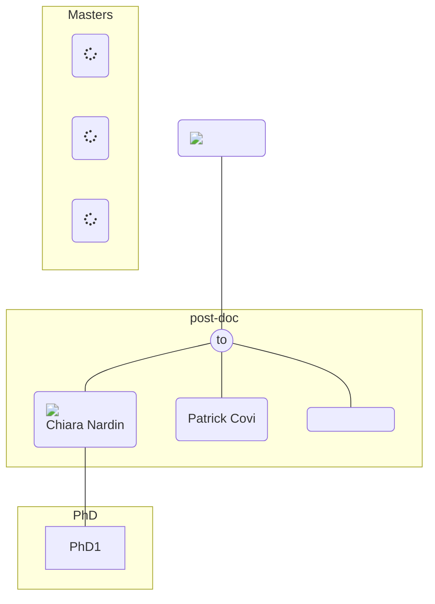

# Table of Content

1. [How to write/take notes](#presentations-meeting-notes)
    1a. [Internal Presentations](#internal-seminarmeeting)
    1b. [External Presentations](#conferencesworkshops)
    1c. [Group Notes](#diary-updates)
2. [How to store data](#backup-system)
    2a. [Git](#git-storage)
    2b. [NAS](#nas)
3. [People](#people)

## Presentations, meeting notes, ...

### Internal Seminar/Meeting

### Conferences/Workshops

### Diary Updates
You can refer to Markdown: [MarkDown](https://commonmark.org/help/)

## Backup system
### Git Storage

#### References
[Git basics](https://readme.phys.ethz.ch/documentation/git_basics/)
[Github](https://github.com/)

### NAS
#### References
[url](https://readme.phys.ethz.ch/documentation/git_basics/)

## People
Last but not least: let's know each other!

#### References
[FlowChart](https://mermaid.js.org/syntax/flowchart.html)